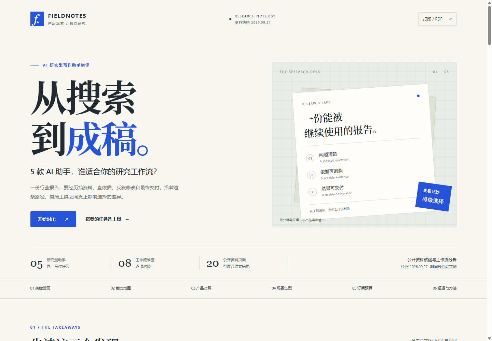

# 从搜索到成稿

**5 款 AI 研究型写作助手，谁适合你的工作流？**

面向 AI 产品实习作品集的交互式研究报告。以“完成一份有引用的行业分析报告”为共同任务，比较 ChatGPT、Claude、Gemini、Kimi、Perplexity 的研究、引用、材料处理、改稿与交付路径。

**[打开完整报告](index.html)** · [网页交互说明](docs/user-guide.html) · [结构化研究数据](data/research.json) · [研究方法与验收](docs/methodology.md)



## 直接使用

下载后双击 `index.html`，用现代浏览器打开即可。页面内嵌全部样式、脚本和研究数据，主体完全离线可用；访问原始来源链接时需要联网。无需安装依赖或启动服务。

- 点击能力地图或矩阵单元格，查看能力说明、适用条件与原文摘录。
- 按工作环节筛选、勾选产品对照，切换四类场景建议。
- 按币种查看价格，切换月付与年付折算，计算实际订阅支出。
- 搜索证据档案，下载研究 JSON 和统一复测任务卡。
- 点击“打印 / PDF”：打印自动展开全部产品、场景、套餐与证据，结束后恢复筛选状态。

## 已完成的研究产出

采集日期：**2026-09-27**。这是公开资料研究与产品选择分析，实际产品效果尚未通过同题任务测量。

| 产出 | 数量与含义 |
|---|---|
| 研究对象 | 5 款消费端 AI 产品 |
| 统一框架 | 8 个维度、40 个比较单元格 |
| 证据档案 | 20 个独立公开页面、21 条采集记录（Kimi 月付与年付分别记录） |
| 原文索引 | 71 条摘录，逐项对应采集文本 |
| 价格记录 | 7 个个人付费方案，保留原币种与付款周期 |
| 产品判断 | 3 条核心发现、4 类场景建议，以及附验证方法的产品机会 |

40 个单元格中保留了历史材料与公开资料未确认项，数量不代表经过实测的能力数量。页面状态明确区分能力说明、适用条件、历史资料与未确认信息；颜色只是辅助标记。

## 可以复述的分析决策

**为什么选这五款？** 它们覆盖通用助手、资料研究入口、已有文档处理和编辑交付等不同路径。选择目的是比较同一任务的工作流，不以市场份额或任意综合分证明代表性。

**怎样核验？** 优先读取官方定价、帮助与产品说明，保存产品入口、适用套餐、地区、计费口径、访问日期、链接、原文与采集文本指纹。结论引用摘录编号，页面从同一份 JSON 生成。引用原文证明的是公开能力声明，实际输出质量需要另外测量。

**核验带来了哪些取舍？**

1. Kimi 当前购买页与帮助中心存在套餐名称差异。价格采用购买页；旧套餐的任务配额不迁移到新套餐。
2. Claude 年付为 US$200，折算 US$16.67/月；这与按月支付 US$20 是不同付款方式，不能将官方取整展示的 US$17 当月付报价。
3. Perplexity 官网和帮助入口访问受限。当前功能用开发者发布的 App Store 说明补充；二手旧资料标明历史状态。应用内购金额缺少计费周期，未绘制成当前网页月付价格。

**差异怎样影响选择？** 资料搜集关注研究范围与来源展示；长材料整理关注文件约束和组织方式；反复改稿关注局部编辑与版本；交付关注可编辑文件与现有办公流程。报告给出基于证据的试用候选和边界，不把“列出引用”解释成“引用必然正确”。

## AI 参与与简历表达

本次 AI 参与公开资料采集、摘录整理、分析草稿、界面实现及自动化检查。用户提出作品目标、研究范围与真实性要求。具体分析取舍在报告中公开，可逐条复核；不将 AI 完成的整理描述成已由用户逐项人工核验。

建议项目名称：**研究型 AI 写作助手竞品分析与交互式报告**。

可用简历表述（应先熟悉并能解释证据与取舍）：

> 围绕有引用的行业分析报告场景，借助 AI 完成 5 款研究型写作助手的 8 维对比，整理 20 个公开页面、71 条来源摘录；处理套餐命名、计费周期与资料时效冲突，交付支持场景筛选、证据追溯和订阅预算计算的离线交互报告，并提出带验证路径的产品机会。

本项目已完成研究网站交付，没有将访谈、付费产品实测、上线运营或效率提升写成已实施成果。统一复测任务卡是后续可执行的研究材料。

## 维护与复现

浏览报告只需浏览器。维护需要 Python 3、Node.js 24+ 和本机 Chrome；脚本仅使用标准库，无 npm 依赖。

```text
data/research.json          唯一事实数据源：产品、事实、套餐、来源与判断
src/report.html            页面骨架
src/styles.css             响应式和打印样式
src/app.js                 筛选、证据、价格与导出交互
scripts/build.py           校验引用并生成单文件报告
scripts/check_browser.mjs  离线浏览器验收与截图
scripts/check_evidence.py  对照本地采集缓存核对摘录
scripts/collect_sources.py 公开页面采集工具
scripts/render_sources.mjs 动态页面采集工具
docs/user-guide.html        面向报告读者的交互操作说明
docs/methodology.md        方法、数据边界与验收记录
index.html                最终可双击交付文件
```

修改 `data/research.json` 或 `src/` 后运行：

```powershell
python -X utf8 scripts/build.py
python -X utf8 scripts/build.py --check
node --check src/app.js
node scripts/check_browser.mjs
```

Chrome 默认位置为 `C:\Program Files\Google\Chrome\Application\chrome.exe`，可用环境变量 `CHROME_PATH` 指定。浏览器检查产物保存在 `.qa/`。原始采集缓存位于 `.research-cache/`，二者均不纳入版本控制；公开交付保留必要摘录、来源链接与文本指纹。

数据时效以快照为准。更新事实时需同时更新来源、摘录、适用条件和受影响判断，再构建页面。本次成果为本地版本，未推送或部署。
